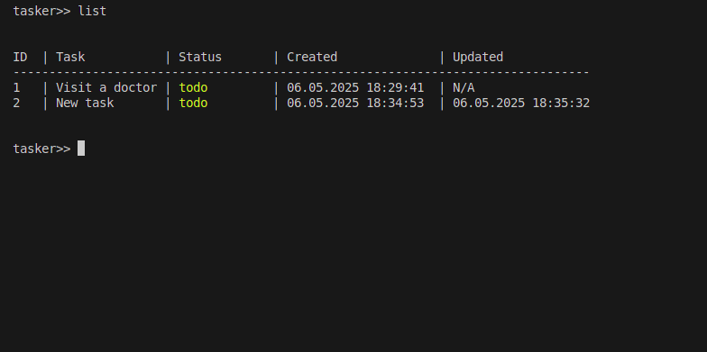

# TASKER: CLI task manager app


## Preview



## Description
**TASKER** - a simple and convenient Python console program for maintaining trackers of habits, goals or tasks. The program allows you to create, edit, view and delete trackers, as well as track daily marks for each of them.
This is a project for 
<pre> https://roadmap.sh/projects/task-tracker </pre>

## Features
- add, update, and delete your tasks
- mark a task as in progress or done
- list all tasks
- list all tasks that are done
- list all tasks that are not done
- list all tasks that are in progress
- see when you created the task and when you updated it

## Project structure
**task_manager.py**:
## Main
- **add_task()**: Adds new tasks with automatic ID generation  
- **delete_task()**: Removes tasks and reindexes remaining ones  
- **update_task()**: Modifies task descriptions  
- **update_status()**: Changes task status  

## Helper Functions
- **parse_input()**: Handles complex command parsing including quoted strings  
- **get_colored_status()**: Provides ANSI color codes for status display  
- **check_file()**: Ensures data file exists  
- **crush_program()**: Handles error termination  

## User Interface
- Interactive command prompt (`tasker>>`)  
- Comprehensive help system (`help` command)  
- Clear error messages for invalid inputs 

**test_tracker.py**: contains tests for the functions defined in task_manager.py.

## Installation and Usage

**Installation: can be done via pip**
1. Make sure you have Python 3.6 or later installed.
2. Clone the repository:

```bash
pip install git+https://github.com/meh-pwn/ToDoTrackerCLI.git
```

(It is recommended to install in virtual mode)

**Usage: The program works in interactive mode. Just follow the instructions in the console.**

1. Type "tasker" in command line

- add task

```bash
tasker>> add "Buy milk"
tasker>> list


ID  | Task     | Status       | Created              | Updated            
--------------------------------------------------------------------------
1   | Buy milk | todo         | 06.05.2025 18:53:08  | N/A  
```

- update task

```bash
tasker>> add "Old task"
tasker>> update 1 "New task"
tasker>> list


ID  | Task     | Status       | Created              | Updated            
--------------------------------------------------------------------------
1   | New task | todo         | 06.05.2025 18:54:27  | 06.05.2025 18:54:42
```

- delete task

```bash
ID  | Task        | Status       | Created              | Updated            
-----------------------------------------------------------------------------
1   | First task  | todo         | 06.05.2025 18:56:04  | N/A                
2   | Second task | todo         | 06.05.2025 18:56:12  | N/A                


tasker>> delete 1
tasker>> list


ID  | Task        | Status       | Created              | Updated            
-----------------------------------------------------------------------------
1   | Second task | todo         | 06.05.2025 18:56:12  | N/A                
```

- mark task as "in progress"

```bash
ID  | Task        | Status       | Created              | Updated            
-----------------------------------------------------------------------------
1   | First task  | todo         | 06.05.2025 18:57:21  | N/A                
2   | Second task | todo         | 06.05.2025 18:57:31  | N/A                


tasker>> mark-in-progress 2
tasker>> list


ID  | Task        | Status       | Created              | Updated            
-----------------------------------------------------------------------------
1   | First task  | todo         | 06.05.2025 18:57:21  | N/A                
2   | Second task | in-progress  | 06.05.2025 18:57:31  | N/A                
```

- mark task as "done"

```bash
ID  | Task        | Status       | Created              | Updated            
-----------------------------------------------------------------------------
1   | First task  | todo         | 06.05.2025 18:57:21  | N/A                
2   | Second task | in-progress  | 06.05.2025 18:57:31  | N/A                


tasker>> mark-done 1
tasker>> list


ID  | Task        | Status       | Created              | Updated            
-----------------------------------------------------------------------------
1   | First task  | done         | 06.05.2025 18:57:21  | N/A                
2   | Second task | in-progress  | 06.05.2025 18:57:31  | N/A  
```

- list / list in-progress / list done / list todo

```bash
tasker>> list


ID  | Task        | Status       | Created              | Updated            
-----------------------------------------------------------------------------
1   | First task  | done         | 06.05.2025 18:57:21  | N/A                
2   | Second task | in-progress  | 06.05.2025 18:57:31  | N/A                
3   | Third task  | todo         | 06.05.2025 19:04:40  | N/A                


tasker>> list in-progress


ID  | Task        | Status       | Created              | Updated            
-----------------------------------------------------------------------------
2   | Second task | in-progress  | 06.05.2025 18:57:31  | N/A                


tasker>> list done


ID  | Task        | Status       | Created              | Updated            
-----------------------------------------------------------------------------
1   | First task  | done         | 06.05.2025 18:57:21  | N/A                


tasker>> list todo


ID  | Task        | Status       | Created              | Updated            
-----------------------------------------------------------------------------
3   | Third task  | todo         | 06.05.2025 19:04:40  | N/A                 
```
